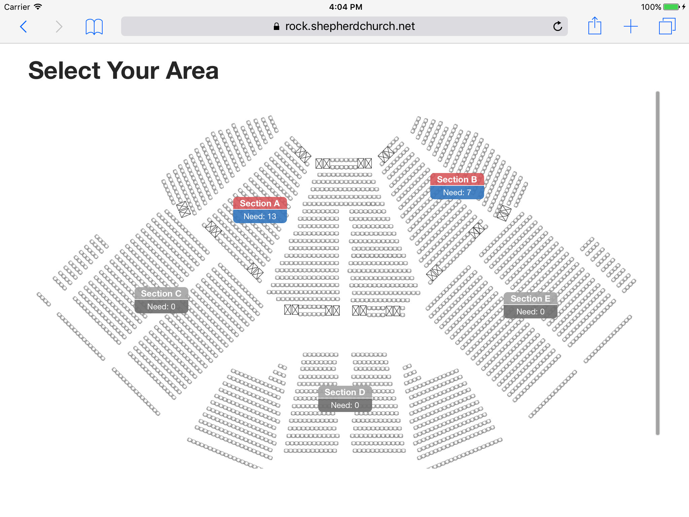
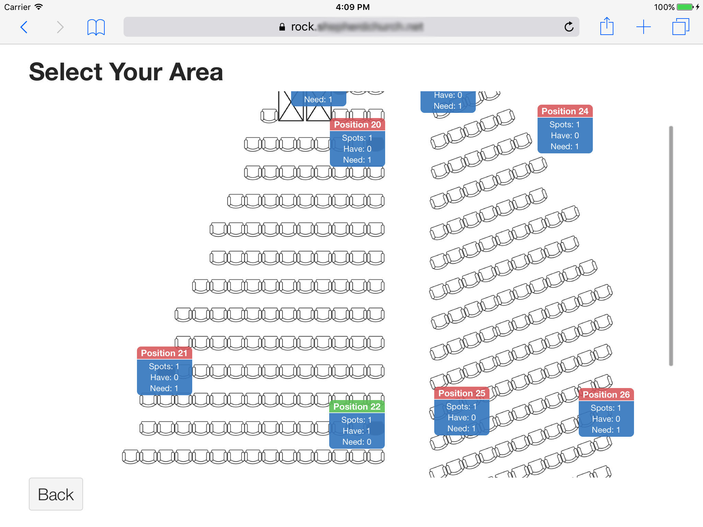

# Overview

Checkin Map is a to have a, simplified, check-in system that is based upon
a visual map that volunteers (or others) can use to find their serving
area. It also allows the administrator to customize the serving need by
providing each serving position with a integer range for the number of
people needed to fulfill that position. Using the same map viewer they
can then tell at a glance where they need more positions filled.

For example, you may have ushers at specific seats throughout your worship
center and want an easy way to know that each position has been filled.
Using the map functionality you can create a checkin system that tracks
each position and displays those positions on a map, allowing you and your
ushers to see exactly where they need to be.

The block is very customizable both with CSS and Lava. For example, out of
the box this is what it might look like to your volunteer who walks up to
a self-serve kiosk looking for a position to serve in.

Your volunteers don't need to know all the details, so they just see the
title of the general area (or position) and how many spots need to be
filled. As an admin, however, you might want a little more information
available to you. By default any logged in user gets a bit more
information.

### Lava Customization

You can of course customize how those "buttons" look with CSS. But you
can also change the content as well as the CSS classes that are applied
to those buttons with Lava. Using one snippet of Lava code you can
override the Title, Body, CSS Classes as well as the URL that is linked
to.

Your Lava code is executed one tiem for each block that needs to be
displayed. It will have the following variables defined already for you.
The ones marked as [editable] mean that you can write to those variables
and the new values will be used after your Lava has finished running.

- Title [editable]
- CssClass [editable]
- Url [editable]
- Item
  - Type - "Area" or "Position"
  - Minimum - Minimum number of spots that must be filled.
  - Maximum - Maximum number of spots that may be filled.
  - Need - Number of spots that still need to be filled.
  - Have - Number of spots that have been filled.
  - Active - "true" if check-in is active for this group, "false" otherwise.
  - Group - The Group object for this item.

We also mentioned the body text of the button. Any text that is rendered out
by your Lava code is used as the body text. You also have access to the
standard Lava variables such as `Context` and `CurrentPerson`. In fact,
using `CurrentPerson` is how we determine wether to show just the Need
value or the entire Spots, Have, Need text.

### Map Customization

Okay, so how much trouble is it to generate these maps and keep them up
to date? Well it depends on how many positions you have. Each position
is configured as a Group in the checkin system. The gist is that you do
most of your work in the Checkin Configuration page like you do now. You
will generate the structure, load in images and set minimum and maximum
need levels for each position in there.

To start with you will create a new Checkin Area and have it inherit from
the new `Checkin Map` type. Then create your structure underneath that.
For example, you could create a child group called `Worship Center` and
then a few children under that called `Section A`, `Section B`, etc.
Finally under each of those you would create a group for each position
to be filled. The structure of the tree is up to you. It can be two levels
deep (map and work positions) or as many levels deep as you wish (map ->
map -> map -> positions).

Anyway, you will notice that these Groups have a few Attributes that you
can configure. The `Background` attribute is for the groups that will have
groups underneath them. That is where you will load in your images that
you want displayed behind the buttons. For any Groups that act as actual
positions to be filled you will populate the `Need` attribute with the
number of spots each position has. For example, you may want up to 3
greeters in your Lobby but only need 1. In this case you would enter the
integer range as 1 - 3. What this does, by default, is make the title of
the position red if nobody has checked in (not filled). It becomes yellow
if 1 or 2 people have checked in (partially filled). Finally it turns
green if all 3 positions have been filled.

There are two more attributes, `Position X` and `Position Y`. Leave
those alone, they get filled in for you by the page we are going to talk
about next.

Finally, each group that will have positions needs a location associated
with it. You can use the same location for each position if you want but
I would recommend keeping them associated with actual rooms. If all your
positions are in the same room fine, just use one room for all positions.
But if you have some greeters in the worship center lobby and some in the
children's building lobby, use different rooms just for sanity.

In your Checkin system, there is a new page provided called `Check-in Map
Configuration`. This will look _very_ similar to the normal `Check-in
Configuration` page you were just using. This is where you setup where
the buttons show up on the map. Just click on one of the groups that have
a background image associated with it. You will see what looks like a
single button in the corner of the image. In truth all those position
groups are just stacked up on top of each other. Use the mouse to click
and drag those buttons wherever you want them.

Once everything is positioned where you want it, click Save and all those
positions are saved as a percentage. This means that whatever device you
display on they will show up in the right place.
